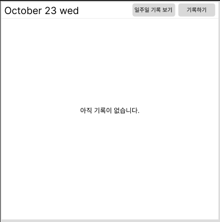
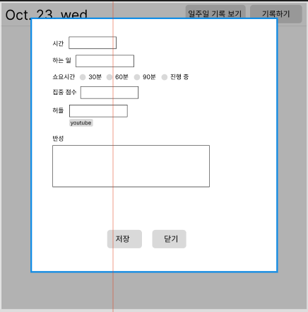
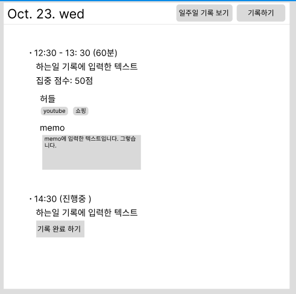
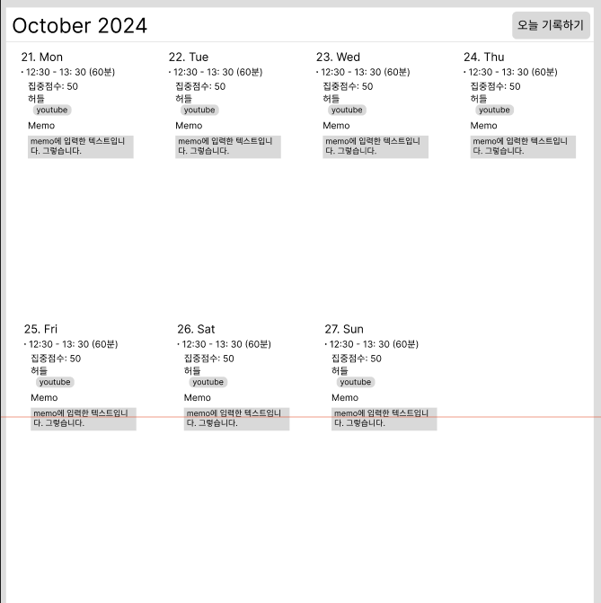

# time-tracker
## spec
- bundler: Vite
- node version: 20.18.0
- npm version: 10.8.2

## 실행 방법
1. npm install
2. npm run dev

---
## 프로젝트 설명
하루에 무엇을 했는지 기록하고 저장하는 프로젝트

## page 구성 및 화면 설명
### daily
url: `/`

#### 내용이 없는 경우

#### 기록하기 눌렀을 경우

- 팝업노출
- 시간
  - 24시간 selectbox로 표시(1:00, 2:00, ... 14:00)
  - 하는일 : text 입력
    - 최대 50자 까지 입력
    - 필수 입력
  - 소요시간
    - 하는 일이 얼만큼 걸린지 표시
      - 라디오 버튼(30분, 60분, 90분)
      - 진행중일 경우 선택시
        - 허들, 반성 disabled
      - 필수입력
    - 허들
      - 집중 시간에 딴짓 한 것을 입력
      - 허용안함
        - 스페이스
      - , 또는 enter를 입력시 아래 라벨 만들어짐
        - 라벨이 만들어지면 input 값은 삭제
        - label에는 삭제 버튼이 있음
      - 반성
        - 100자 까지 입력
      - 비 필수

#### 팝업에서 일력후

- 팝업에서 입력한 부분이 노출
- 소요시간에 진행중을 선택한 경우
  - 시간 옆에 `(진행중)` 표시
  - 하는일만 표시 (집중) 점수, 허들, 반성은 표시 안 함
  - 기록 완료하기 버튼 노출
    - 누를 경우 팝업 노출
    - 입력했던 시간과, 하는일이 표시

### weekly
url: `/weekly`

- 월요일을 기준으로 일주일 노출
  - 오늘이 23일 수요일이라면 `21일 월요일에서 27일 일요일` 까지 노출
  - 오늘 기록하기를 클릭
    - url `/`로 이동
    - 입력한 기록이 있으면 노출
